<div align="center">
  


# 부산대학교 LINC3.0 캡스톤디자인


<br>


>PT를 받으면서 일정이나 운동 기록을 수기로 관리하느라 불편하셨나요?<br>
HealthMate는 회원과 트레이너 모두를 위한 PT 관리 앱입니다.<br>
회원은 운동/식단 기록과 통계를 한눈에 확인하고, 트레이너는 회원권과 일정을 효율적으로 관리할 수 있어요.<br>
깔끔한 디자인과 직관적인 사용법으로 누구나 쉽게 이용할 수 있습니다.

</div>

<br>

## 개발 기간

```markdown
2024.03 ~ 2024.10 (7개월)
```

## 개발자

<table>
  <tbody>
    <tr>
      <td align="center"><a href="https://github.com/rhfo0509"><br /><b>김응서</b></a><br /></td>
    </tr>
  </tbody>
</table>


## 시작 가이드

### 설치 및 실행

```bash
# 1. Repository 클론
git clone https://github.com/rhfo0509/HealthMate.git
cd HealthMate/front

# 2. 패키지 설치
npx expo install

# 3. 환경 변수 설정
# .env 파일 생성 후 아래 내용 입력
EXPO_PUBLIC_FIREBASE_API_KEY=your_api_key
EXPO_PUBLIC_FIREBASE_AUTH_DOMAIN=your_auth_domain
EXPO_PUBLIC_FIREBASE_DATABASE_URL=your_database_url
EXPO_PUBLIC_FIREBASE_PROJECT_ID=your_project_id
EXPO_PUBLIC_FIREBASE_STORAGE_BUCKET=your_storage_bucket

# 4. 개발 서버 실행
npx expo start
```

### Firebase 설정

1. [Firebase Console](https://console.firebase.google.com/)에서 프로젝트 생성
2. **Authentication** 활성화 (이메일/비밀번호 로그인)
3. **Firestore Database** 생성
4. **Storage** 활성화
5. 프로젝트 설정에서 앱 등록 및 설정 파일 다운로드

## 주요 기능

### 회원 기능

<table style="width: 100%;">
<tr>
<td width="50%">

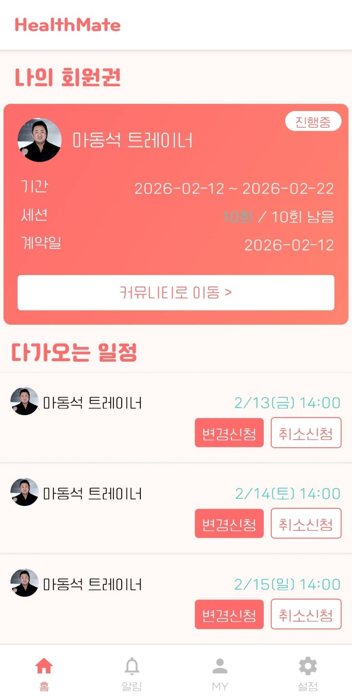
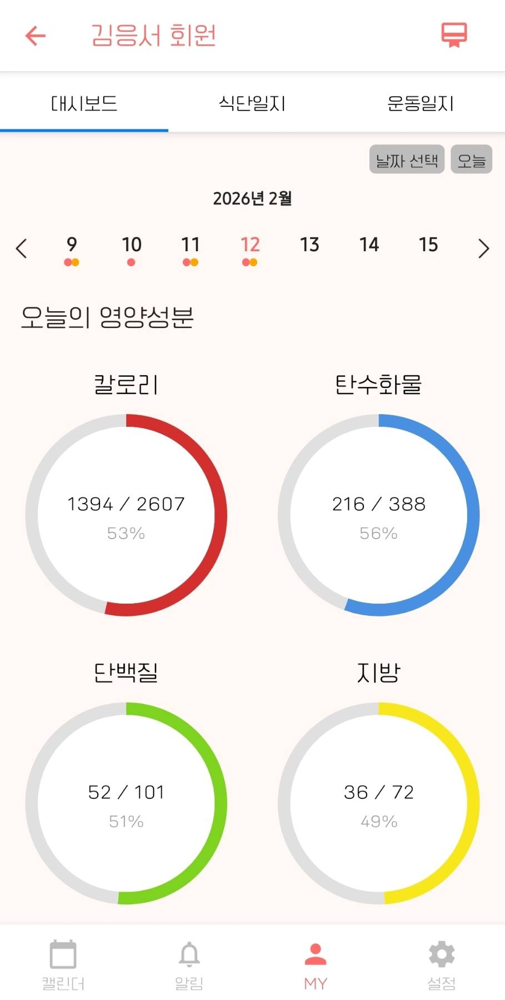

</td>
<td width="50%">

#### 홈 및 대시보드

나의 회원권 정보를 조회할 수 있어요.<br>
다가오는 일정을 확인할 수 있어요.<br>
대시보드에서는 나의 운동량과 식단량을 한눈에 볼 수 있어요.

</td>
</tr>

<tr>
<td>

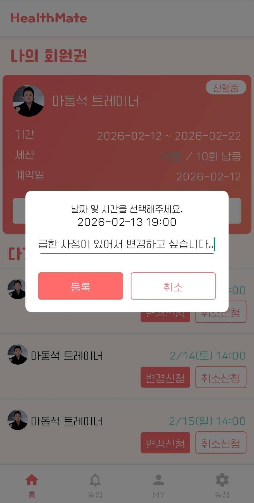
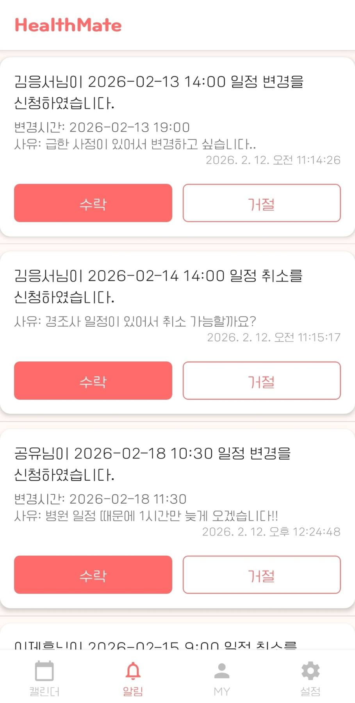

</td>
<td>

#### 일정 변경 및 알림

일정을 변경하거나 취소하고 싶을 때, 트레이너에게 요청을 보낼 수 있어요.<br>
트레이너는 알림을 확인하고 요청을 수락하거나 거절할 수 있어요.

</td>
</tr>

<tr>
<td>

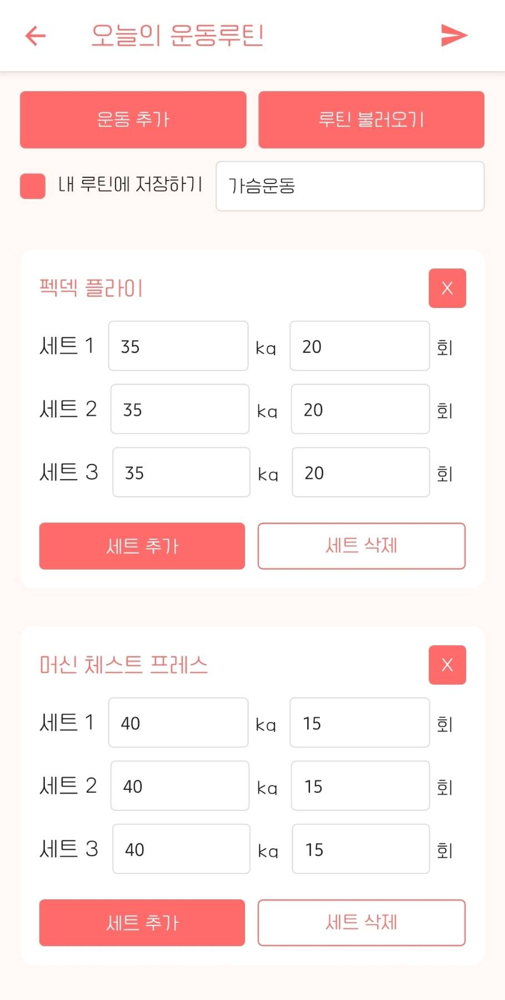


</td>
<td>

#### 운동 루틴 및 일지

자주 하는 운동 루틴을 저장해두고, 운동할 때마다 세트/무게/횟수를 기록할 수 있어요.<br>
운동 기록을 남기면 트레이너가 확인하고 피드백을 줄 수 있어요.

</td>
</tr>

<tr>
<td>

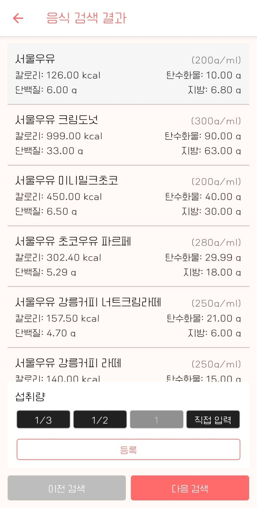
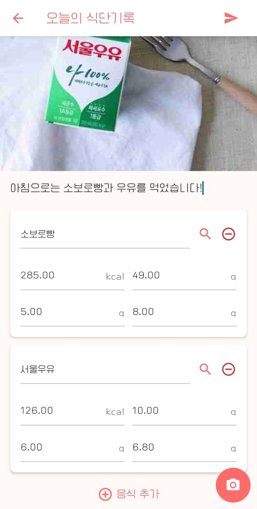

</td>
<td>

#### 식단 일지

음식 이름으로 검색해서 칼로리, 탄수화물, 단백질, 지방을 확인할 수 있어요.<br>
식단 기록을 남기면 트레이너가 확인하고 피드백을 줄 수 있어요.

</td>
</tr>

<tr>
<td>

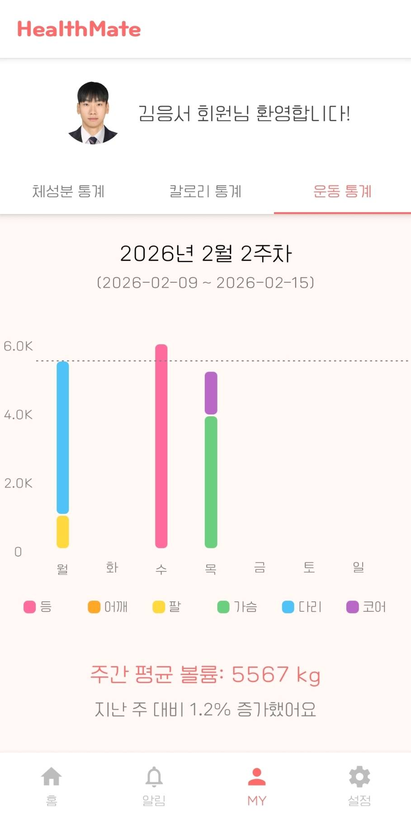
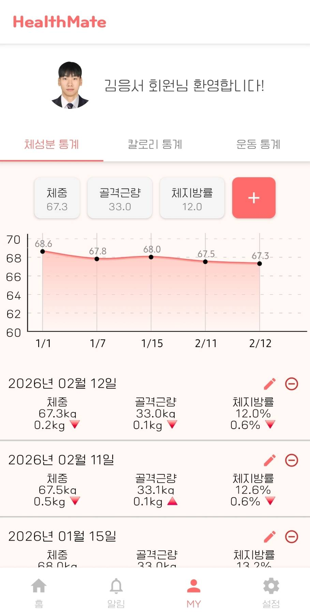

</td>
<td>

#### 통계 그래프

근육량, 체지방량, 체중을 입력하면 그래프로 변화 추이를 확인할 수 있어요.<br>
부위별 운동량, 칼로리 섭취량을 그래프로 확인할 수 있어요.

</td>
</tr>
</table>

---

### 공통 기능

<table style="width: 100%;">
<tr>
<td width="50%">

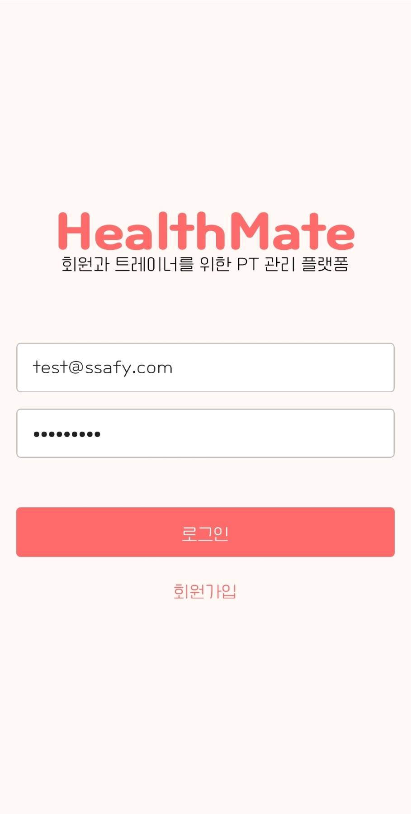
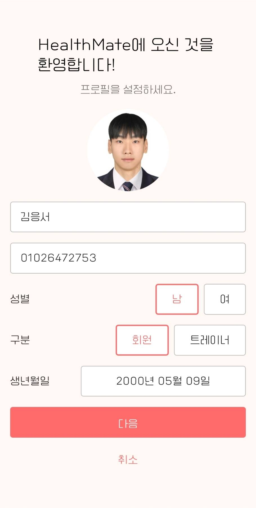

</td>
<td width="50%">

#### 로그인 및 프로필

이메일로 가입하고 로그인할 수 있어요.<br>
프로필 사진, 이름 등 정보를 등록할 수 있어요.<br>

</td>
</tr>

<tr>
<td>

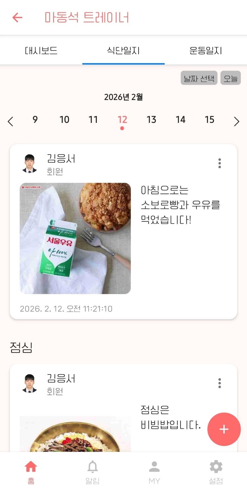
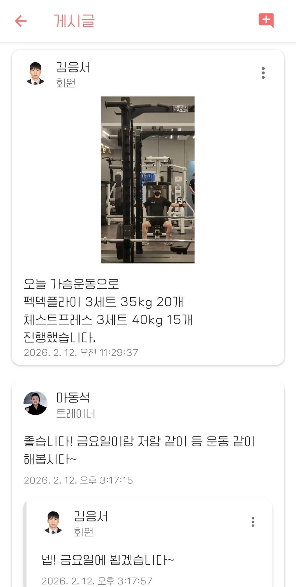

</td>
<td>

#### 게시글 및 댓글

운동/식단 일지를 게시글로 공유할 수 있어요.<br>
댓글 및 대댓글을 통해 트레이너와 회원이 소통할 수 있어요.

</td>
</tr>
</table>

---

### 트레이너 기능

<table style="width: 100%;">
<tr>
<td width="50%">

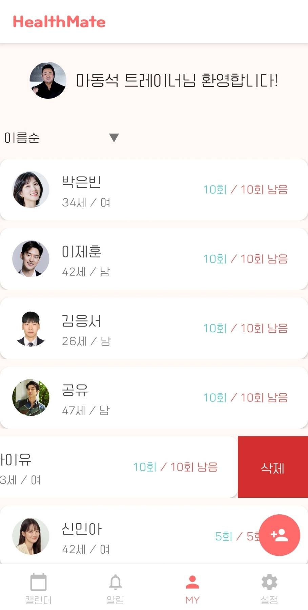
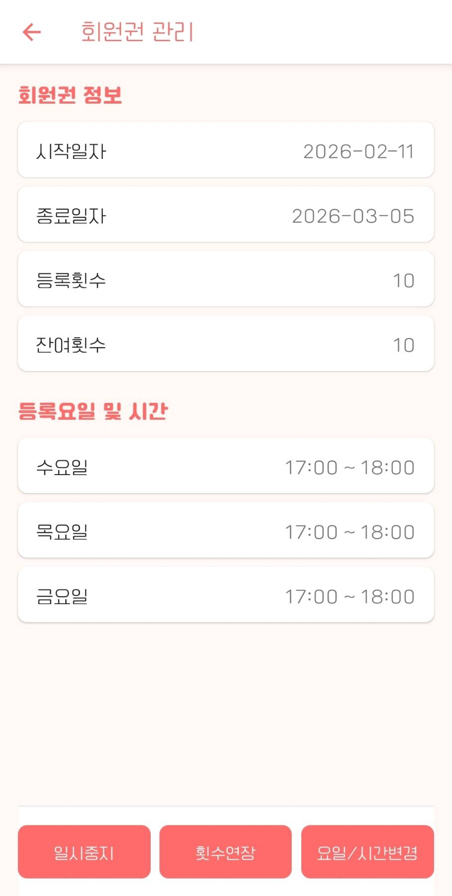

</td>
<td width="50%">

#### 회원 및 회원권

담당 회원을 관리할 수 있어요.<br>
새 회원에게 회원권을 발급하고 관리할 수 있어요.<br>
횟수 연장, 잔여 횟수 조정, 일시중지 등을 할 수 있어요.

</td>
</tr>

<tr>
<td>

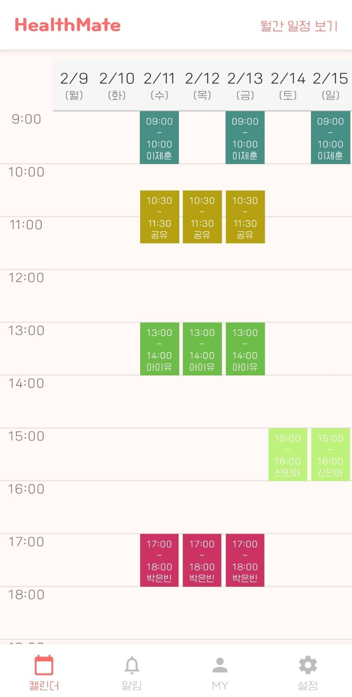
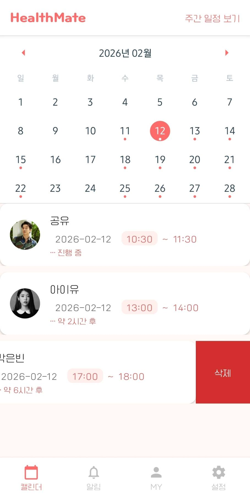

</td>
<td>

#### 일정 캘린더

주간/월간 스케줄을 한눈에 확인할 수 있어요.<br>
트레이너도 일정 변경 및 취소를 할 수 있어요.<br>

</td>
</tr>
</table>

## 프로젝트 구조

```
HealthMate/
├── front/                    # React Native 앱
│   ├── src/
│   │   ├── components/       # 재사용 컴포넌트
│   │   ├── contexts/         # Context API
│   │   ├── hooks/            # Custom Hooks
│   │   ├── lib/              # Firebase 함수
│   │   ├── navigation/       # 네비게이션 설정
│   │   ├── screens/          # 화면 컴포넌트
│   │   └── styles/           # 공통 스타일 (colors, theme)
│   ├── assets/               # 이미지, 폰트 등
│   ├── firebaseConfig.js     # Firebase 초기화
│   └── package.json
└── back/                     # Firebase Functions
```

## 디자인 시스템

### 색상 팔레트
**Primary**: Coral (`#FF6B6B`) - 주요 액션 및 강조

**Background**: Light Coral Tint (`#FFF8F5`) - 화면 배경

**Surface**: White (`#FFFFFF`) - 카드 및 입력 필드

**Text**: Dark Gray (`#1F1F1F`) - 기본 텍스트

### 타이포그래피
**Main Font**: `Cafe24SsurroundAir` - 본문, 버튼, 입력

**Title Font**: `Cafe24Ssurround` - 로고, 타이틀
